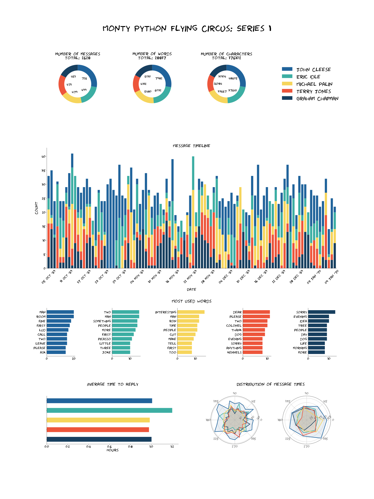

# Chatviz

A python library to visualize chats from various platforms.

Currently supports out of the box:
 - WhatsApp
 - Facebook Messenger
 - SMS
 
Other chat technologies can be visualized easily after the data is loaded into a dataframe.

# Example

Here is an example of the output:

